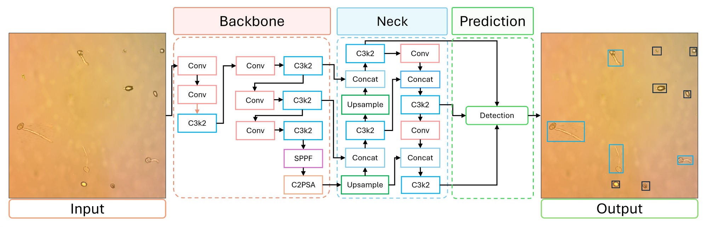

# Transfer Learning for Predicting Germination Rates in *Botrytis cinerea* (Grey Mold Disease)

This repository contains the full pipeline for detection and analysis of *Botrytis cinerea* conidia germination rates using transfer learning with the YOLOv11 architecture.

---

## 📁 Repository Structure

<details>
<summary><strong>Click to expand</strong></summary>

```plaintext
📦Botrytis-Germination-TL/
├── 📁 Train/
│   └── YOLOv11.ipynb            # Model training notebook using YOLOv11
├── 📁 Test/
│   ├── 📁 Germinación/          # Inference and visualization notebooks
│   │   ├── Inferencia.ipynb
│   │   └── Detection.ipynb
│   └── 📁 Models/               # Pretrained models
│       └── YOLOv11.pt
```

</details>

---

## 🔍 YOLOv11 Architecture

The following figure shows the high-level architecture of YOLOv11 used in this study:



YOLOv11 combines high-resolution feature extraction with efficient prediction heads, making it ideal for detecting small fungal structures like conidia.

---

## 🧪 Inference Workflow

To run detection on test images, use the notebooks provided in the `Test/Germinación/` folder:

1. **Detection.ipynb** – Runs YOLOv11 on input images and outputs bounding boxes.
2. **Inferencia.ipynb** – Visualizes detection results and computes germination statistics.

Example of a detection result:


---

## 🧩 Requirements

- Python ≥ 3.8
- PyTorch ≥ 2.0
- OpenCV
- Ultralytics
- Jupyter Notebook
- Other dependencies listed in `requirements.txt`

Install dependencies via terminal:

```bash
pip install -r requirements.txt
```

Or inside a notebook:

```python
!pip install -r requirements.txt
```

---

## 🚀 How to Use This Project

### 1. Clone the repository

```bash
git clone https://github.com/LuisGomez-Meneses/Botrytis-Germination-TL.git
cd Botrytis-Germination-TL
```

### 2. Install dependencies

```bash
pip install -r requirements.txt
```

Or inside Jupyter:

```python
!pip install -r requirements.txt
```

### 3. Run the notebooks

- Training: `Train/YOLOv11.ipynb`
- Inference: `Test/Germinación/Detection.ipynb` or `Inferencia.ipynb`

To launch Jupyter:

```bash
jupyter notebook
```

---

## 📜 License

This project is distributed under the MIT License.
